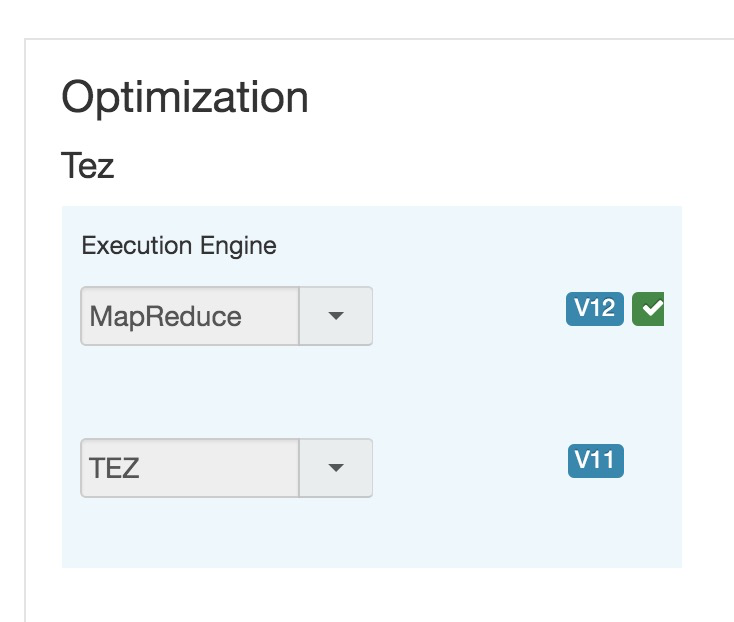

# Operational Overview with Ambari

**GOAL** - Using the Hortonworks Sandbox, provide an overview of Apache
Ambari; especially from the perspective of the Ops perspective of 
administering a Hadoop cluster

**PREREQUISITE** - [Sandbox Setup](../SandboxSetup.md)

**SEE ALSO** - [Hortonworks Ambari Page](http://hortonworks.com/hadoop/ambari/)

**RECORDED DEMO**

<a href="http://www.youtube.com/watch?feature=player_embedded&v=AWRMQmLmuMk" target="_blank"></a>

**PRIOR DEMO CLEANUP** - None

## Ambari's Role

[Apache Ambari](http://ambari.apache.org/ "Ambari") aids very specifically with the following areas for a Hadoop cluster

* Installation
* Upgrades
* Configuration
* Expansion
* Start/Stop Operations
* Monitoring

## Installation

A quick way to get a feel for the LOE involved in manually configuring
a Hadoop cluster is to look at the activities required.  The 
[Manual Installation Guide](http://docs.hortonworks.com/HDPDocuments/HDP2/HDP-2.4.0/bk_installing_manually_book/bk_installing_manually_book-20160301.pdf "Manual Install")
devotes almost 200 pages to this, while the comparable 
operations in the 
[Ambari Installation Guide](http://docs.hortonworks.com/HDPDocuments/Ambari-2.2.1.0/bk_Installing_HDP_AMB/bk_Installing_HDP_AMB-20160301.pdf "Ambari Install")
span about 15 pages.

While both approaches require HW & OS prep activities, the Ambari route
quickly differs by only needing two quick CLI operations, 
```yum install ambari-server``` and ```ambari-sever setup```, before
focusing on its GUI wizard process to completely install a cluster.

While the [Sandbox Setup](../SandboxSetup.md) that we are using already
has an installed version of HDP, you can get a sense of this install wizard
by starting the process of adding a new service.  Click on _Actions_ > 
_Add Service_ > _Accumulo_ > _Next_ to see something like presented in the
[Add Service Wizard](./images/AddServiceWizard.png?raw=true) screenshot.

**_Be sure to exit out of this wizard to prevent service form attempting
to be installed._**

## Configuration

As visualized in this [figurative example](./images/HadoopFiles.png?raw=true), Hadoop installation files get spread across the file system and across all the nodes
in the cluster.  Installation with Ambari ensures all get to the right place
and subsequent configuration changes with Ambari also ensures appropriate, 
primarily XML, files are accurate updated as well as guides the operator 
through any possibly restart activities to ensure they are utilized.

For example, search for `execution` within `/etc/hive/conf/hive-site.xml` to 
find the following stanza.

```xml
    <property>
      <name>hive.execution.engine</name>
      <value>tez</value>
    </property>
```

To see how to set that, as well as what values are acceptable just navigate to _Services_ > _Hive_ > _Configs_
> _Settings_ > _Optimization_ > _Execution Engine_.  You
can even change it to MapReduce and save a new version to 
see the visual compare tools like shown below
before reverting back to the prior version.


 
## Expansion

Ambari shines when it is time to grow your cluster with additional nodes.  It
already has all the bits to distrubute and intellegently deploys all required
configuration files.  

## Start/Stop Operations

Very straight-forward to stop and/or start services.  The ability to mark
something in Maintenance Mode is great to silence alarms about a particular
service not being operational.

## Monitoring

As you can see from the Dashboard view, monitoring is a key element of Ambari.
All of these events can also be integerated into your unified dashboard that
spans multiple technologies and vendors.