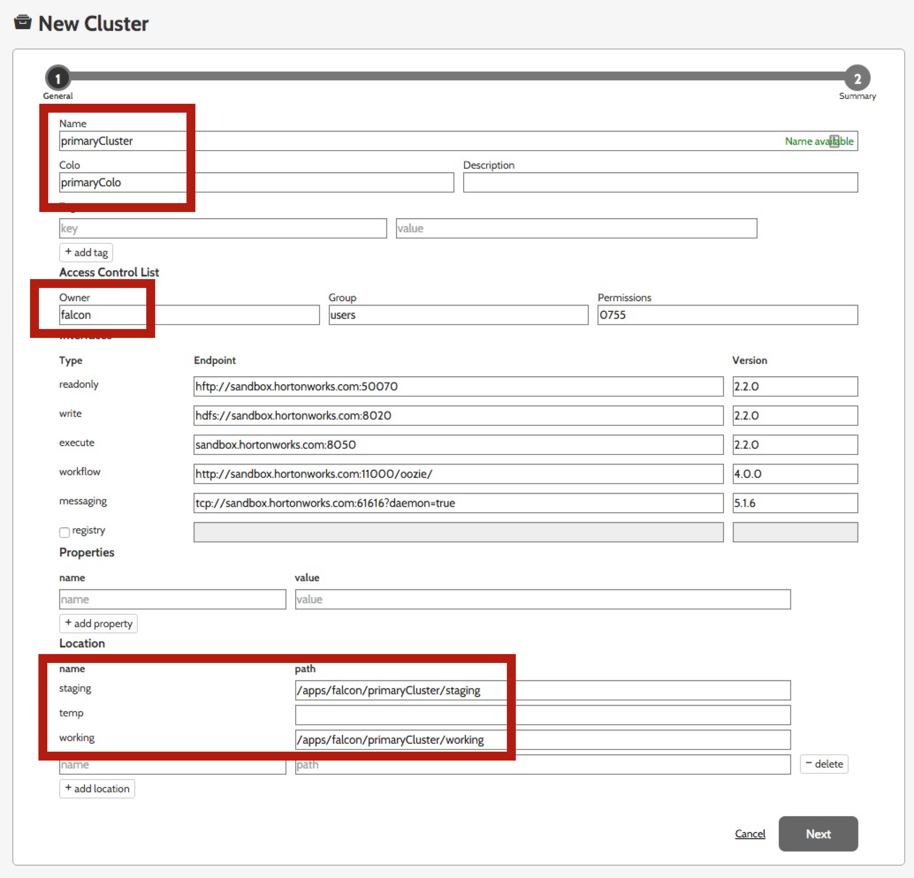
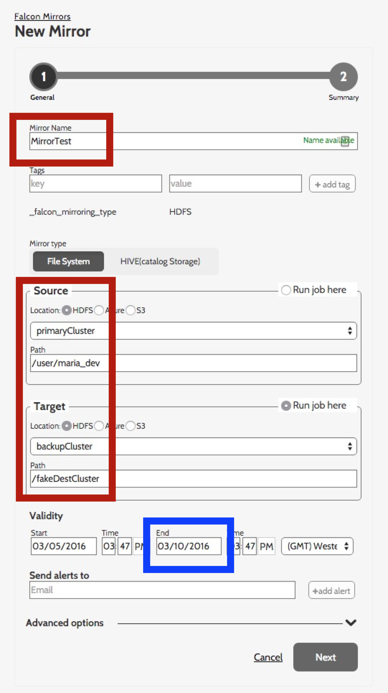
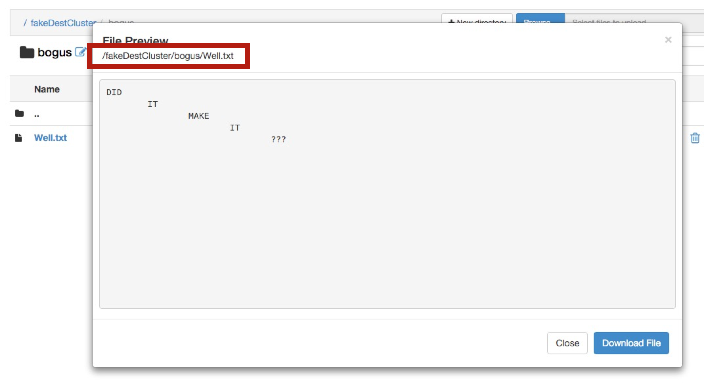

# Data Pipelining with Falcon

**GOAL** - Use Falcon to mirror directories from a source to a target cluster 
via Ranger

**PREREQUISITE** - [Ingesting Data into HDFS](../ingestion/README.md)

**SEE ALSO** - This demo is based on these two publicly-available 
Hortonworks tutorials:

* [Mirroring Datasets between Hadoop clusters with Apache Falcon](http://hortonworks.com/hadoop-tutorial/mirroring-datasets-between-hadoop-clusters-with-apache-falcon/ "Mirroring Data with Falcon") 
* [Define and Process Data Pipelines in Hadoop with Apache Falcon](http://hortonworks.com/hadoop-tutorial/defining-processing-data-end-end-data-pipeline-apache-falcon/ "Data Pipeling with Falcon") 

**RECORDED DEMO**

<a href="http://www.youtube.com/watch?feature=player_embedded&v=Bp96x70HpEM" target="_blank"></a>

## Admin Setup

As Ranger is an administrative tool, there are some initial activities that
need to be completed in order to establish the source and target Hadoop 
clusters.  NOTE: In this demo we will actually use the same (Sandbox) cluster
and simply have different directories _simulating_ different clusters.

### Directory Creations

As described in [Securing Hive with Ranger](../ranger/README.md)'s "Allow
Marketing to use Ambari" section, log into Ambari as `admin` and use the
_Create Local User_ functionality to build a `falcon` user and add them into
the `views` group.

Now log back into Ambari as `falcon` and using the HDFS Files View, create
the following directories that will be used by Falcon to stored control 
information about the clusters.

```
/apps/falcon/primaryCluster
/apps/falcon/primaryCluster/staging
/apps/falcon/primaryCluster/working
/apps/falcon/backupCluster
/apps/falcon/backupCluster/staging
/apps/falcon/backupCluster/working
```

The Ambari HDFS Files View does not currently let you modify permissions, so
perform the following CLI operations via a terminal window.

```
HW10653-2:~ lmartin$ ssh root@127.0.0.1 -p 2222
root@127.0.0.1's password: 
Last login: Sat Mar  5 20:33:12 2016 from 10.0.2.2
[root@sandbox ~]# su - falcon
[falcon@sandbox ~]$ hdfs dfs -chmod -R 777 /apps/falcon/*
[falcon@sandbox ~]$ hdfs dfs -chmod -R 755 /apps/falcon/primaryCluster/working /apps/falcon/backupCluster/working
```

Now, as `hdfs` create a directory to act as our destination cluster.

```
[falcon@sandbox ~]$ exit
logout
[root@sandbox ~]# su - hdfs
[hdfs@sandbox ~]$ hdfs dfs -mkdir /fakeDestCluster
[hdfs@sandbox ~]$ hdfs dfs -chown -R falcon /fakeDestCluster
```

### Define Clusters

Logged into Ambari as `admin`, start up `Oozie` and `Falcon` if necessary.

The Sandbox splash screen indicates you can visit <http://127.0.0.1:15000> 
to log into Falcon as user `falcon`.  You then just need to click on the 
_Cluster_ icon in the upper-left of the screen just under the _Create an 
entity_ message.  Add the following values to define your "primary" cluster.

Key | Value
--- | ---
Name|primaryCluster
Colo|primaryColo
Owner|falcon
staging|/apps/falcon/primaryCluster/staging
working|/apps/falcon/primaryCluster/staging

You can see the location of these required KVPs in the next screenshot.



Just click on _Next_ to see a confirmation screen and _Save_ to persist
this cluster definition.

Using the same process, create a second cluster to emulate the target
cluster.  Use the following KVPs.

Key | Value
--- | ---
Name|backupCluster
Colo|backupColo
Owner|falcon
staging|/apps/falcon/backupCluster/staging
working|/apps/falcon/backupCluster/staging

## Setup Mirroring Job

The plan is to create a Falcon "mirror" job to replicate the contents of
`maria_dev`'s home directory to our (fake) destination cluster which is 
emulated by the `/fakeDestCluster` directory.  To do this, click on the 
_Mirror_ icon in the upper-middle of the screen that is associated with 
the _Create an entity_ message.  Name the job `MirrorTest` and select the
previously described `Source`/`Target` values as indicated in red below.



Now, verify that the start date is no later than the current date/time 
and add an end date of a few days from now (highlighted in blue above) 
to ensure the job will run and then click on `Next`.  After reviewing 
the confirmation screen, click on `Save`.

Now, log into Ambari as `maria_dev` and create a new `bogus` directory in
her home directory and then load a file, or files, such as [Well.txt](./Well.txt).

## Run the Job

In Falcon, type `MirrorTest` in the search bar at the top of the screen
to locate the job.  Then select the checkbox next to the job and click
the _Schedule_ button.


Notice that the job _Status_ has now changed to `RUNNING`.


Then, navigate to `/fakeDestCluster` to verify that the contents of 
`/user/maria_dev` have been mirrored.



Now that we verified the job has run successfully, go ahead and _Suspend_
or _Delete_ it from the Falcon UI.

NOTE: See [Falcon Cluster Management](ClusterManagement.md) for assistance
with deleting a cluster.