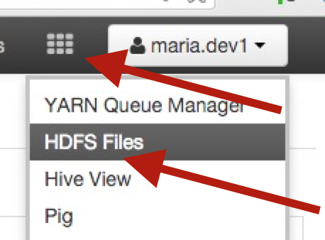

# Ingesting Data into HDFS

This demo is based on the publicly-available 
[Loading Data into HDFS](http://hortonworks.com/hadoop-tutorial/hello-world-an-introduction-to-hadoop-hcatalog-hive-and-pig/#section_4 "Tutorial: Loading Data") 
Hortonworks tutorial.

## Data Files

For all the demos in this Essentials course, we are focused on a trucking company example.  Save the [Geolocation.zip](./Geolocation.zip) file to your
local disk drive and unzip it.  You should now find the following files.

* **geolocation.csv** – This is the collected geolocation data from the trucks. it contains records showing truck location, date, time, type of event, speed, etc.
* **trucks.csv** – This is data was exported from a relational database and it shows info on truck model, driverid, truckid, and aggregated mileage info.

## Log into Ambari

With a properly configured [Sandbox Setup](../SandboxSetup.md) you can  
use userid `maria_dev` with password of `maria_dev` when logging into Ambari.
Once you get to the Dashboard, click on the "Ambari View" icon that is
just to the left of the users' name in the upper right corner of the UI as
shown in the following screenshot.

Clicking on _HDFS Files_ brings up the file viewer.

## Manipulating Files

At this point, it should be self-explanatory how to upload these two files 
into the user's home directory of `/user/maria_dev`.