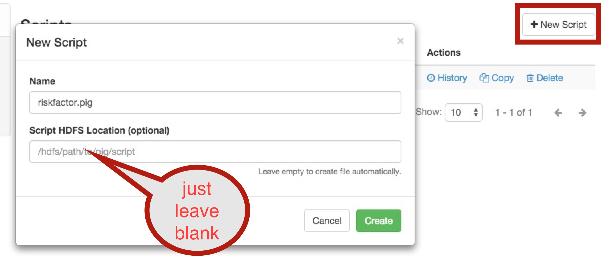

# Risk Analysis with Pig

**GOAL** - Create and execute a Pig script that leverages Hive structures
via HCatalog to calculate risk factors for drivers

**PREREQUISITE** - [Data Manipulation with Hive](../hive/README.md)

**SEE ALSO** - This demo is based on the publicly-available 
[Pig Risk Factor Analysis](http://hortonworks.com/hadoop-tutorial/hello-world-an-introduction-to-hadoop-hcatalog-hive-and-pig/#section_6 "Calculating Risk with Pig") 
Hortonworks tutorial

**RECORDED DEMO**

<a href="http://www.youtube.com/watch?feature=player_embedded&v=eOhv60m0kkc" target="_blank"></a>

## Create Tables

The diagram below indicates the steps we have taken in the Hive demo as well
as the ones we will be taking in this risk analysis effort demo.


In the Hive View & logged in as `maria_dev`, run the follow CTAS from the
previously created `truck_mileage` table and verify it gets loaded properly.

```sql
CREATE TABLE driver_mileage STORED AS ORC AS
    SELECT driverid, sum(miles) totmiles
      FROM truck_mileage
     GROUP BY driverid;
```

Ultimately, we want to create a risk factor that is based on the total number
of miles driven by each driver divided by the number of abnormal events across
the period where the miles have been summarized.  We will do that with Pig, but
first we need to create a table to stored these calculated values into.

```sql
CREATE TABLE risk_factor 
    (driverid string, events bigint,
     totmiles bigint, riskfactor float)
STORED AS ORC;
```

## Build Pig Script

Click the _New Script_ button in Pig View to get started and save it as
`riskfactor.pig` without specifing a specific path.  



NOTE: Try to use the _Pig helper_ when building each line of the script.

Load the `geolocation` Hive table.  

```pig
geo = LOAD 'geolocation' 
    USING org.apache.hive.hcatalog.pig.HCatLoader();
``` 

Filter out any normal events as we are looking for risky events.

```pig
riskyEvents = FILTER geo BY event != 'normal';
```

Project the data to include a count field and to exclude fields that are not
relevant for the risk analysis.

```pig
thinRiskies = FOREACH riskyEvents GENERATE 
    driverid, event, (int) '1' as occurance; 
```

Group all risky events for each driver.

```pig
driverGroupings = GROUP thinRiskies BY driverid;
```

Calculate a total number of these events for each driver.

```pig
countsByDriver = FOREACH driverGroupings GENERATE 
    group as driverid, SUM(thinRiskies.occurance) as total_occurrences;
```

Load the `driver_mileage` Hive table we created earlier in this demo. 

```pig
mileage = LOAD 'driver_mileage' 
    USING org.apache.hive.hcatalog.pig.HCatLoader();
``` 

Join the driver's mileage table with the Pig alias that contains the 
total number of risky events for the same driver.

```pig
joinResult = JOIN countsByDriver BY driverid, mileage BY driverid;
```

To see what the schema definition looks like for this joined output, run 
`describe joinResult;` which will return the following (NOTE: if you 
run this you will need to add the `-useHCatalog` property as described
later in this demo guide).

```pig
joinResult: 
    {countsByDriver::driverid: chararray,
     countsByDriver::total_occurrences: long,
     mileage::driverid: chararray,
     mileage::totmiles: long}
```

## Calculate Results

As declared earlier, our driver risk factor is determined by dividing
the total miles traveled by risky events occurrences.

```pig
final_data = foreach joinResult generate 
    countsByDriver::driverid as driverid, 
    countsByDriver::total_occurrences as events, 
    mileage::totmiles as totmiles, 
    (float) mileage::totmiles / countsByDriver::total_occurrences as riskfactor;
```

And now that we projected the `final_data` Pig alias into the exact schema as 
our `risk_factor` Hive table, we can simply use `HCatStorer` to insert the
data into the table.

```pig
STORE final_data INTO 'risk_factor' 
    USING org.apache.hive.hcatalog.pig.HCatStorer();
```

At this point, you should have something similar to the following commented script.

```pig
--load the Hive table called geolocation
geo = LOAD 'geolocation' 
    USING org.apache.hive.hcatalog.pig.HCatLoader();

--get rid of non risky behavior
riskyEvents = FILTER geo BY event != 'normal';

--get rid of attributes we don't need and create a counter one
thinRiskies = FOREACH riskyEvents GENERATE 
    driverid, event, (int) '1' as occurance; 

--lump all events uniquely for each driver
driverGroupings = GROUP thinRiskies BY driverid;

-- Total up the events for each driver
countsByDriver = FOREACH driverGroupings GENERATE 
    group as driverid, SUM(thinRiskies.occurance) as total_occurrences;

--load the driver_mileage Hive table
mileage = LOAD 'driver_mileage' 
    USING org.apache.hive.hcatalog.pig.HCatLoader();

--join the calculated driver counts with previously created driver's mileage
joinResult = JOIN countsByDriver BY driverid, mileage BY driverid;

--results from "describe joinResult"
--   joinResult: {countsByDriver::driverid: chararray,
--                countsByDriver::total_occurrences: long,
--                mileage::driverid: chararray,
--                mileage::totmiles: long}

--calculate the risk factor as total miles / # of risky events
final_data = foreach joinResult generate 
    countsByDriver::driverid as driverid, 
    countsByDriver::total_occurrences as events, 
    mileage::totmiles as totmiles, 
    (float) mileage::totmiles / countsByDriver::total_occurrences as riskfactor;

--save the results into the risk_factor Hive table
STORE final_data INTO 'risk_factor' 
    USING org.apache.hive.hcatalog.pig.HCatStorer();
```

NOTE: BE SURE TO SAVE YOUR WORK!!

Before you can run the Pig script you will need to configure the Pig Editor
to use HCatalog so that the Pig script can load the dependent libraries.  In
the _Pig argument_ text box in the bottom-right of the screen, enter 
`-useHCatalog` and click the _Add_ button.


After clicking the _Add_ button you should see the following.


Now, check the _Execute on Tez_ checkbox and click the _Execute_ button in
the upper-right corner of the screen.  Once
the job completes successfully you will not see any output as it is stored in
the `risk_factor` Hive table.

Navigate to the Hive View and find the five drivers with the worst calculated
risk factors.

```sql
SELECT * 
  FROM risk_factor
 ORDER BY riskfactor
 LIMIT 5;
```

## Visualize Results

Pig does not have any native visualization tools.  You can exercise the 
[Data Reporting with Excel](http://hortonworks.com/hadoop-tutorial/hello-world-an-introduction-to-hadoop-hcatalog-hive-and-pig/#section_8 "Reporting with Excel") 
Hortonworks tutorial which can be reviewed in 
[this video](http://hortonworks.com/hadoop-tutorial/hello-world-an-introduction-to-hadoop-hcatalog-hive-and-pig/#section_8 "Excel Visualizations").

COTS solutions from BI tool vendors are also common ways to visualize 
these aggregated values for many large enterprises as well as dedicated 
Hadoop tools like Datameer are also popular.

