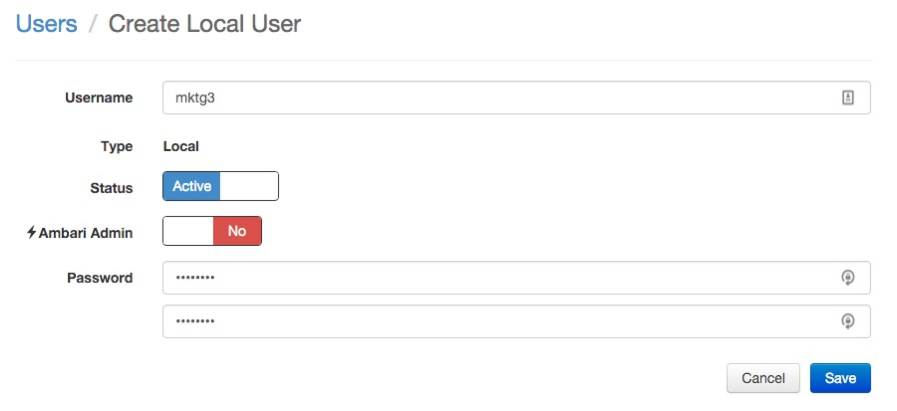

# Securing Hive with Ranger

**GOAL** - Demonstrate some cornerstone capabilities of configuring Hive access 
via Ranger

**PREREQUISITE** - [Risk Analysis with Pig](../pig/README.md)

**SEE ALSO** - This demo is based on these two publicly-available 
Hortonworks tutorials:

* [Securing your Data Lake Resource & Auditing User Access with HDP Advanced Security](http://hortonworks.com/hadoop-tutorial/securing-data-lake-auditing-user-access-using-hdp-security/ "HDP Advanced Security") 
* [Securing HDFS, Hive and HBase with Knox and Ranger](http://hortonworks.com/hadoop-tutorial/manage-security-policy-hive-hbase-knox-ranger/ "Knox and Ranger") 

**RECORDED DEMO**

<a href="http://www.youtube.com/watch?feature=player_embedded&v=nr6fmpSo6oI" target="_blank"></a>

## Use Cases

The Sandbox is provisioned with a user group called `Marketing` which is made up
of the following individual user accounts; `mktg1`, `mktg2` and `mktg3`. The 
following **_"prevent `Marketing` users from access to access ..."_** restrictive
use cases will be explored in this demo.

Type | Specifics
--- | ---
Table|`geolocation_stage` and `trucks_stage`
Row|Where `geolocation.event` is not equal to `normal`
Column|`events` and `totmiles` from `risk_factor` 

## Environment Preparation

### Create Hive View

As we will see later in this demo, a Hive View will be needed to fully 
implement the row-level security requirement.  Logged into Ambari as 
`maria_dev`, run the following DDL.


```sql
CREATE VIEW geo_normal_event AS
    SELECT * FROM geolocation
     WHERE event = 'normal';
```

Ensure results are returned `SELECT * FROM geo_normal_event LIMIT 100;`
is executed. 

### Allow Marketing to use Ambari

The `Marketing` users are already created on the underlying Linux system, but
they need to be allowed to log into Ambari so they can use the Hive View. 
Log into Ambari as `admin` and go to the _admin_ pulldown in upper-right corner,
select _Manage Ambari_ > _Users_ > _Create Local User_ and then create accounts
for `mktg1`, `mktg2` and `mktg3` (set password to `password` for all three) 
which should look like the following.



After creating the third user, click on the _Groups_ link in the left-side 
_User + Group Management_ UI widget to view the list of groups.  Click on the
_views_ group which will expose a _Local Members_ box where you can add the
three `Marketing~ users to and should look like the following.


### Disable Hive Global Access

As identified in the Sandbox splash page, open a browser on the Ranger UI at
<http://127.0.0.1:6080> and login with `admin` / `admin` credentials.  Select
the _Sandbox_hive_ link and then click on _Policy ID_ link associated with 
the "Hive Global Tables Allow" policy from the list.

Move the _Policy Name_'s `enabled` slider selection to `disabled` and click
on the _Save_ button at the bottom.


### Verify Preparation

At this point, the `Marketing` users should not be able see any tables.  Log
into Ambari as `mktg1` and within the Hive View validate no tables are listed
under the `default` _Databases_ table list as well as `show tables;` returns
an empty list.  Additionally, a security error should be display when 
attempting to run a query.


## Table-Level Restriction

GOAL: **_Prevent `Marketing` users from accessing `geolocation_stage` 
and `trucks_stage` tables_** 

Since we are starting with zero access to `Marketing`, we will create a 
single security policy to allow the team to view all tables except the 
staging ones.  Log into Ranger as `admin` and navigate to _Sandbox_hive_
and then click _Add New Policy_ to create a policy named "Default Mktg
Access to Trucking" that is configured to allow access to all tables in
the `default` database except for the "staging" ones.


Now, back in Ambari's Hive View, the `mktg1` user can retrieve results 
for `show tables;` as well as see the list of tables in the _Databases_ UI
widget.  More importantly, this user can now run queries on the tables 
shown in the list (ex: `SELECT * FROM driver_mileage LIMIT 100;`).

To validate the table-level restrictions are in place, attempt to run a query
on one of the staging tables to verify a security error is presented.


## Row-Level Restriction

GOAL: **_Prevent `Marketing` users from accessing rows from `geolocation` 
table when the `event` column has a value other than `normal`_** 

Row-level security is not an intrinsic feature of Hive yet, but as this 
[HCC discussion](https://community.hortonworks.com/questions/1156/what-is-the-best-way-to-implement-row-based-securi.html "HCC discussion") indicates, the common
approach to this need is to create a Hive View that selects only the data
that you want to grant/restrict access to and then secure the View, and 
the underlying table, accordingly.

At the beginning of the demo we created a `geo_normal_event` view that 
the `Marketing` team can access.  Obviously, we did this ahead of time, but
in a model where the requirement comes along after the structures are in
place, one simply needs to create the view and then lock down access to 
the backing table.

To satisfy this requirement with our current system, simply edit the 
"Default Mktg Access to Trucking" policy in Ranger to include `geolocation`
along with the staging tables being restricted.


To verify, ensure `mktg2` can select from `geo_normal_event`, but not from `geolocation`.


## Column-Level Restriction

GOAL: **_Prevent `Marketing` users from accessing the `events` and `totmiles` 
columns of the `risk_factor` table_** 

To implement this requirement we can simply modify the same Ranger policy 
to exclude access to these columns (with this configuration, these column names
would be restricted from any table).


To verify, log into Ambari as `mktg3` and verify the following message surfaces 
when attempting to execute `SELECT * FROM risk_factor LIMIT 100;`.


Verify all works correctly when selecting only allowed columns.

```sql
SELECT driverid, riskfactor FROM risk_factor LIMIT 100;
```

## Environment Reset

Return to the Hive policy list in Ranger and perform the following actions.

* **Disable** the "Default Mktg Access to Trucking" policy
* **Enable** the "Hive Global Tables Allow" policy